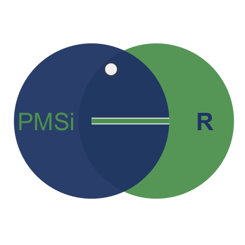

# pmeasyr : données PMSI avec R




***Guillaume Pressiat***

***SIMAP / DOMU / AP-HP***

*17 septembre 2017*

Un [livret numérique en ligne](https://guillaumepressiat.github.io/pmeasyr/) présente le fonctionnement du package et donne des exemples de codes (imports, requêtes, analyses) pour se familiariser à son utilisation.

Une [page github](https://guillaumepressiat.github.io/) rassemble toutes les informations autour du package : la documentation, des exemples ainsi que la présentation et le suivi des évolutions avec la partie [bloc-notes](https://guillaumepressiat.github.io/blog/).

Une vidéo est aussi [disponible](https://guillaumepressiat.github.io/blog/2017/06/video-intro).

## Contexte

Les données du Programme de Médicalisation des Systèmes d'Informations (PMSI) sont souvent traitées via des logiciels spécifiques au PMSI (ou des outils statistiques / bases de données du marché) ne permettant pas de réaliser des traitements statistiques et des infographies satisfaisantes. Les départements d'information médicale sont donc souvent amenés à retraiter ces données avec R.

L'évolution récente de R intègre la manipulation de bases de données de taille importante. Le package *pmeasyr* s'inscrit dans cette veine et permet de réaliser de façon autonome l'ensemble des traitements (de l'import des données à leur analyse) avec R.

## Avantages de R

### Un flux de travail unique

En travaillant uniquement avec R, on peut mettre en place un flux de travail épuré : un seul projet, un seul programme, un seul logiciel. La traçabilité, la reproductibilité et la mise à jour des opérations sont ainsi facilitées.

Le travail avec de multiples logiciels oblige à l'export / import de fichiers entre les différents logiciels, et chaque modification du début du flux de travail génère des fichiers exportés v1, v2, ...

Avec un flux complet dans R, toute nouvelle modification est intégrée au processus de travail global. La localisation de toutes les étapes d'une analyse en un seul point évite les erreurs et la confusion lorsque l'on reprend l'analyse ultérieurement.

### R et le PMSI

L'utilisation de R confère aux données du PMSI la liberté proposée par le logiciel :

   - les requêtes sur les diagnostics et les actes peuvent s'écrire de multiples façons et c'est l'utilisateur qui crée ses propres programmes
   - les données sont dans R : prêtes pour des modèles linéaires, logistiques, des classifications...
   - la confrontation des données in\* (reflet du codage des établissements) aux données out\* (reflet de la valorisation accordée à l'établissement) est facilitée par l'import du fichier tra (cf [vignette](https://im-aphp.github.io/pmeasyr/articles/vignette.html#tra)), cela peut permettre aux équipes DIM d'améliorer leur recueil  
   - le reporting de l'activité en excel, pdf, word, html, ou en créant des applications (shiny)
   - l'utilisation des graphiques pour représenter des volumes d'activités et des cartographies interactives pour visualiser la localisation d'activités, de patientèles, et les flux de patients
   - le partage de projets RStudio, qui facilite et encourage les travaux en équipe.

**NB: Données In / Out : données en entrée / sortie des logiciels de l'ATIH*

### Des outils performants

L'engouement autour de R est lié au développement de packages intuitifs et performants : *readr*, *dplyr*, *tidyr*, *magrittr*, pour n'en citer que quelques-uns. *pmeasyr* s'appuie sur ces packages pour proposer des imports de données rapides sur des fichiers de taille importante (l'entité juridique de l'AP-HP est prise en charge sans problème avec un ordinateur récent).

Dans le cas de *pmeasyr*, l'import de 100 000 rsa (partie fixe, parsing des passages unités médicales, des diagnostics associés et des actes) nécessite en moyenne 5 secondes avec un processeur i7 -- 16Go de ram.

En dernier ressort, R travaillant en mémoire vive, les exécutions de requêtes sont très rapides. 

## Contenu du package

Le package contient des fonctions pour la gestion des archives PMSI en entrée / sortie des logiciels de l'ATIH : dézippage, suppression des archives, et des fonctions pour l'import des fichiers des champs PMSI MCO, SSR, HAD, PSY et RSF.

Il est utilisé depuis un an à l'AP-HP pour des analyses d'activité et la description des prises en charge.

## Installation du package

### Depuis github avec devtools

```
devtools::install_github('IM-APHP/pmeasyr')
``` 

Cette commande lance l'installation du package et de ses dépendances.

## Pour commencer

La vignette introductive du package donne des exemples de commandes pour les traitements des données du champ PMSI MCO.

```
browseVignettes('pmeasyr')
```

Ou bien consulter la [vignette en ligne](https://im-aphp.github.io/pmeasyr/articles/vignette.html).

## Pour poursuivre

Une [page github](https://guillaumepressiat.github.io/) rassemble toutes les informations autour du package : la documentation, des exemples ainsi que la présentation et le suivi des évolutions avec la partie [bloc-notes](https://guillaumepressiat.github.io/blog/).

------------


<p align="center">
  SIMAP / DOMU / AP-HP<br>
  
</p>

